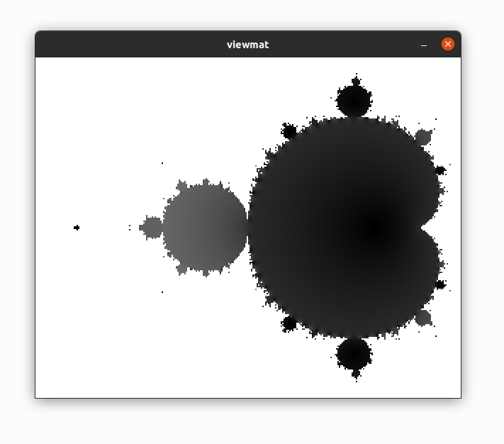

Running Examples
================

There are many example scripts in the ``examples/`` directory. To run an
example, type its name followed by the ``example`` command:

::

   aya> "nth_fib" example
   The first 10 fib numbers are [ 1 1 2 3 5 8 13 21 34 55 ]

Some examples are in subfolders such as ``canvas``, ``turtle``, or
``plot``. Run them using ``subfolder/example_name``:

::

   aya> "canvas/mandelbrot" example

   img/mandelbrot_example.png
